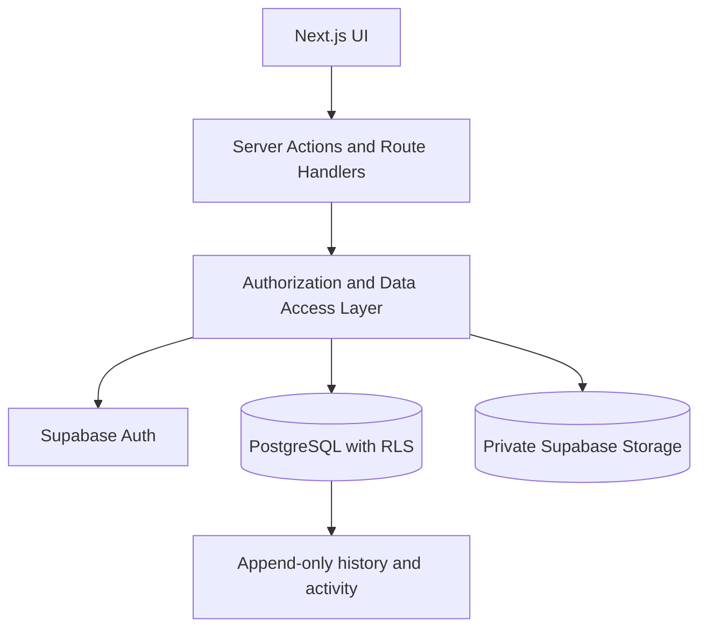
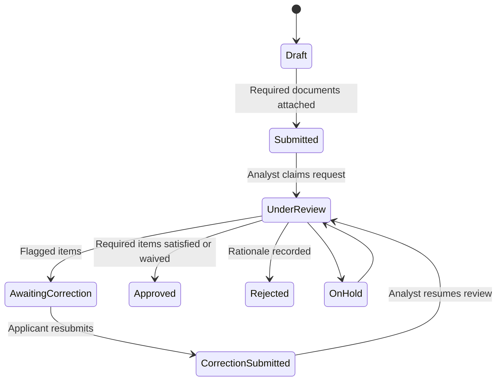

# Architecture

## Request workflow

## Trust boundaries

- Browser input is untrusted. Server Actions authenticate, authorize, and validate every mutation.
- PostgreSQL Row Level Security independently limits readable and writable rows.
- Uploaded files remain in a private bucket. Downloads use short-lived signed URLs after a database authorization check.
- `status_history`, `review_actions`, and `activity_log` are append-only.
- The browser receives the public Supabase anonymous key only. A service-role key is neither required nor exposed.
